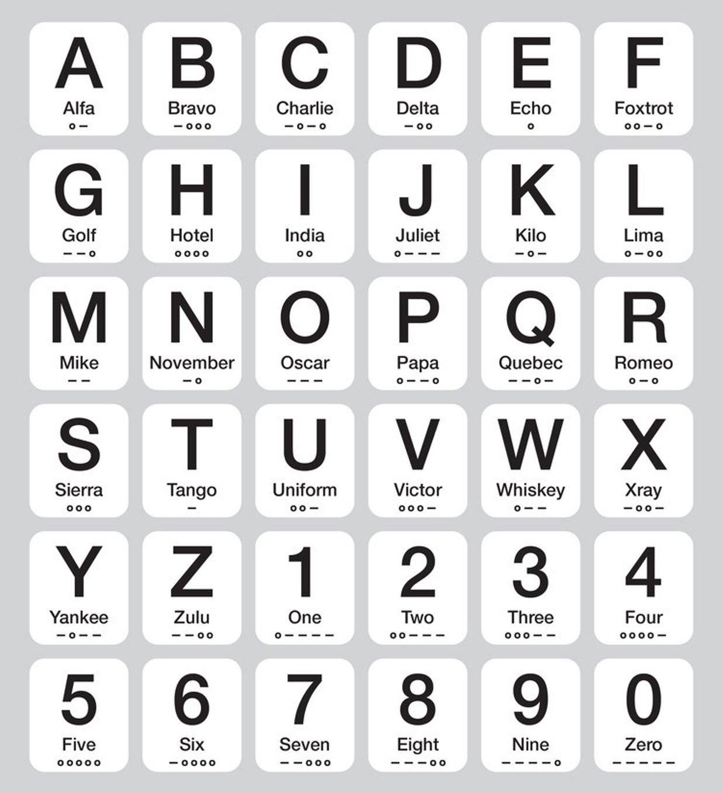

# :zap: Go: Data Structures, Algorithms and Design Patterns
Data Structures, Algorithms and Design Patterns along with AR|VR|MR landscape. In-depth internals, my personal notes, example codes and projects.

## Author
Aditya Hajare ([Linkedin](https://in.linkedin.com/in/aditya-hajare)).

## Current Status
WIP (Work In Progress)!

## License
Open-sourced software licensed under the [MIT license](http://opensource.org/licenses/MIT).

----------------------------------------

## Important Notes
- `Slices` store items in an `ordered` manner.
- `Maps` store items in an `unordered` manner.

----------------------------------------

### Applications of linked list in computer science

- Implementation of stacks and queues
- Implementation of graphs : Adjacency list representation of graphs is most popular which uses linked list to store adjacent vertices.
- Dynamic memory allocation : We use linked list of free blocks.
- Maintaining directory of names
- Performing arithmetic operations on long integers
- Manipulation of polynomials by storing constants in the node of linked list
- representing sparse matrices

### Applications of linked list in real world

- `Image viewer` – Previous and next images are linked, hence can be accessed by next and previous button.
- `Previous and next page in web browser` – We can access previous and next url searched in web browser by pressing back and next button since, they are linked as linked list.
- `Music Player` – Songs in music player are linked to previous and next song. you can play songs either from starting or ending of the list.

### Applications of Circular Linked Lists

- Useful for implementation of queue. Unlike this implementation, we don’t need to maintain two pointers for front and rear if we use circular linked list. We can maintain a pointer to the last inserted node and front can always be obtained as next of last.
- Circular lists are useful in applications to repeatedly go around the list. For example, when multiple applications are running on a PC, it is common for the operating system to put the running applications on a list and then to cycle through them, giving each of them a slice of time to execute, and then making them wait while the CPU is given to another application. It is convenient for the operating system to use a circular list so that when it reaches the end of the list it can cycle around to the front of the list.
- Circular Doubly Linked Lists are used for implementation of advanced data structures like Fibonacci Heap.
- A great way to represent a deck of cards in a game.
- The browser cache which allows you to hit the BACK button (a linked list of URLs)
- Applications that have a Most Recently Used (MRU) list (a linked list of file names)
- A stack, hash table, and binary tree can be implemented using a doubly linked list.
- Undo functionality in Photoshop or Word (a linked list of state)

----------------------------------------

### Applications of stack (LIFO)

- The basic application of stack is **backtracking**. i.e. to track (keep a record) of from where we begun to where we got.
- Stacks are used in **undo** mechanism in text editor.
- Language processing:
    * space for parameters and local variables is created internally using a stack.
    * compiler's syntax check for matching braces is implemented by using stack.
    * support for recursion.
    * Expression evaluation like postfix or prefix in compilers.
- Backtracking (game playing, finding paths, exhaustive searching.
- Memory management, run-time environment for nested language features. etc
- Arithmetic expression evaluation. An important application of stacks is in parsing. For example, a compiler must parse arithmetic expressions written using infix notation. For example the following infix expression evaluates to 212.
    ```go
    ( 2 + ( ( 3 + 4 ) * ( 5 * 6 ) ) )   // 212
    ```
- Function-call abstraction. Most programs use stacks implicitly because they support a natural way to implement function calls, as follows: at any point during the execution of a function, define its state to be the values of all of its variables and a pointer to the next instruction to be executed. The natural way to implement the function-call abstraction is to use a stack. To call a function, push the state on a stack. To return from a function call, pop the state from the stack to restore all variables to their values before the function call and resume execution at the next instruction to be executed.


----------------------------------------

### Applications of queue (FIFO)

- Queue is a `FIFO linear data structure` and inserting a new element takes place from an end called `rear`, and removal of existing element takes place from other end called `front`.
- When a resource is shared among multiple consumers. Examples include CPU scheduling, Disk Scheduling.
- When data is transferred asynchronously (data not necessarily received at same rate as sent) between two processes. Examples include IO Buffers, pipes, file IO, etc.
- Queue is used in **BFS(Breadth First Search)** algorithm. It helps in traversing a tree or graph.
- Queue is also used by Operating systems for job scheduling.
Q- ueue is used in networking to handle congestion.
- **Snake Game** in old Nokia phones.

----------------------------------------

### Applications of binary trees

- The reason that binary trees are used more often than `n-ary` trees for searching is that `n-ary` trees are more complex, but usually provide no real speed advantage.
- In a (balanced) binary tree with `m` nodes, moving from one level to the next requires one comparison, and there are `log_2(m)` levels, for a total of `log_2(m)` comparisons.
- [Binary Search Tree](http://en.wikipedia.org/wiki/Binary_search_tree) - Used in **many** search applications where data is constantly entering/leaving, such as the `map` and `set` objects in many languages' libraries.
- [Binary Space Partition](http://en.wikipedia.org/wiki/Binary_space_partitioning) - Used in almost every 3D video game to determine what objects need to be rendered.
- [Binary Tries](http://en.wikipedia.org/wiki/Radix_tree) - Used in almost every high-bandwidth router for storing router-tables.
- [Hash Trees](http://en.wikipedia.org/wiki/Hash_tree) - used in p2p programs and specialized image-signatures in which a hash needs to be verified, but the whole file is not available.
- [Heaps](http://en.wikipedia.org/wiki/Heap_(data_structure)) - Used in implementing efficient priority-queues, which in turn are used for scheduling processes in many operating systems, Quality-of-Service in routers, and A* *(path-finding algorithm used in AI applications, including robotics and video games)*.  Also used in heap-sort.
- [Huffman Coding Tree](http://en.wikipedia.org/wiki/Huffman_coding) ([Chip Uni](https://stackoverflow.com/questions/2130416/what-are-the-applications-of-binary-trees/2174096#2174096)) - used in compression algorithms, such as those used by the .jpeg and .mp3 file-formats.
- [GGM Trees](http://www.wisdom.weizmann.ac.il/~/oded/ggm.html) - Used in cryptographic applications to generate a tree of pseudo-random numbers.
- [Syntax Tree](http://en.wikipedia.org/wiki/Abstract_syntax_tree) - Constructed by compilers and (implicitly) calculators to parse expressions.
- [Treap](http://en.wikipedia.org/wiki/Treap) - Randomized data structure used in wireless networking and memory allocation.
- [T-tree](http://en.wikipedia.org/wiki/T-tree) - Though most databases use some form of B-tree to store data on the drive, databases which keep all (most) their data in memory often use T-trees to do so.
- The organization of Morse code is a binary tree:



----------------------------------------